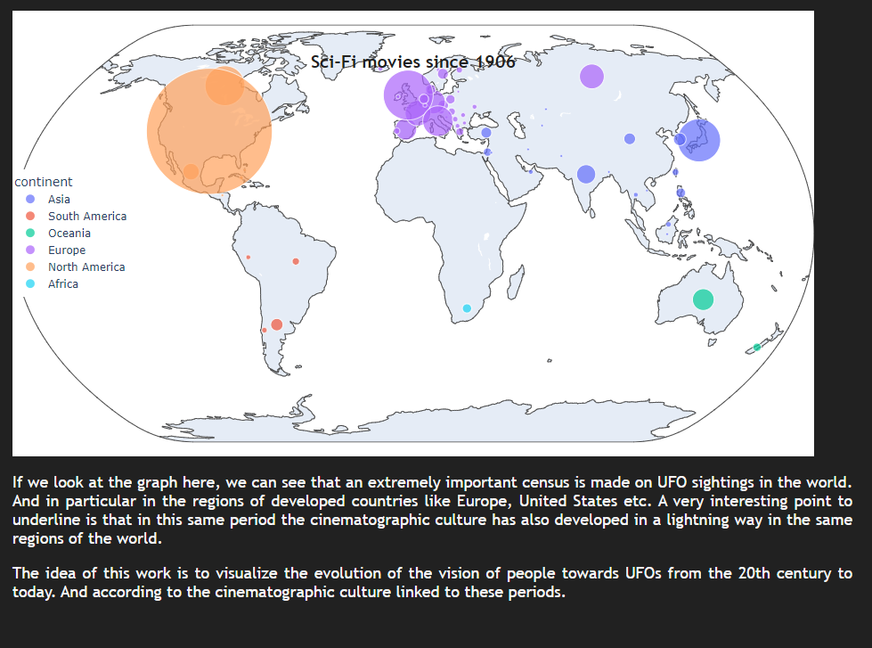
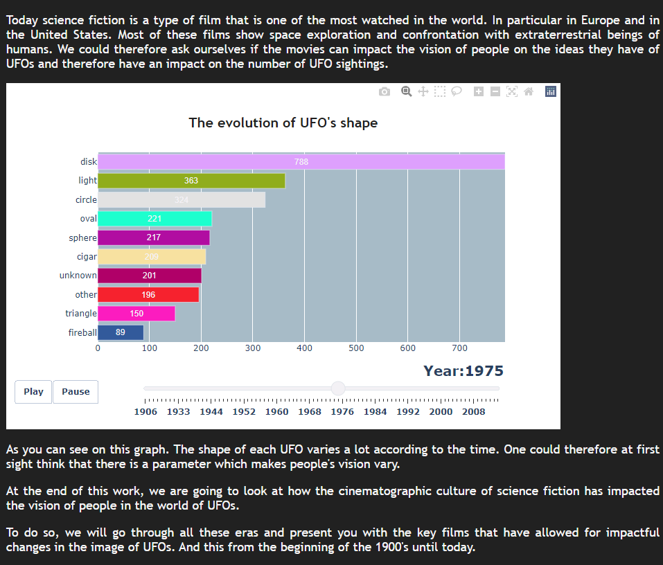
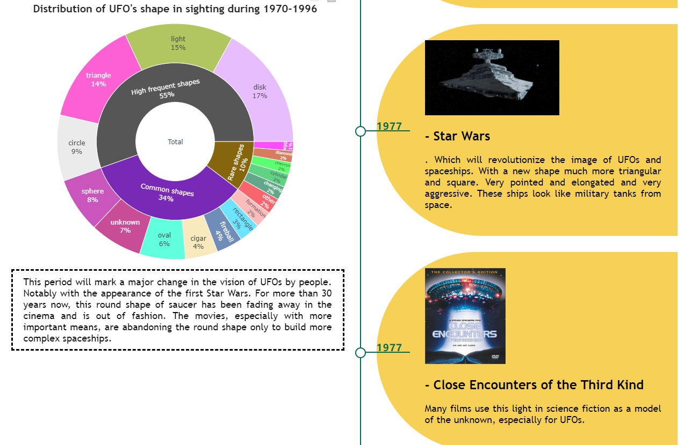

# UFO_sighting_dataset
Data set source: `https://www.kaggle.com/NUFORC/ufo-sightings`

Please run `app.py` and open the web page to see the content

This report is to analyze the global UFO observation data in the past 100 years and compare it with science fiction movies of the same period to discuss whether there is some correlation between them.

# demo

